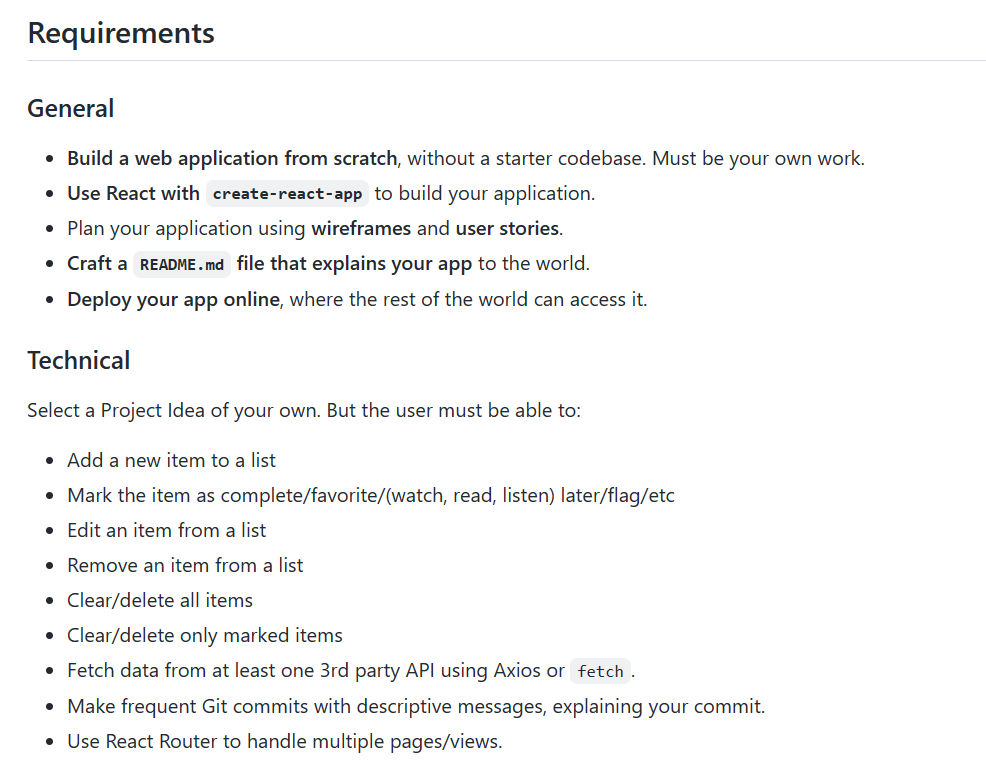
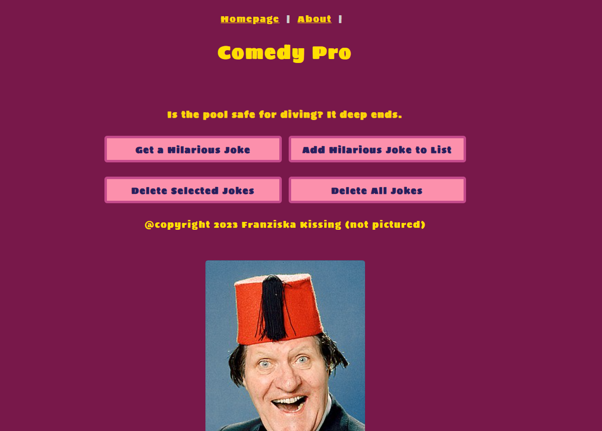
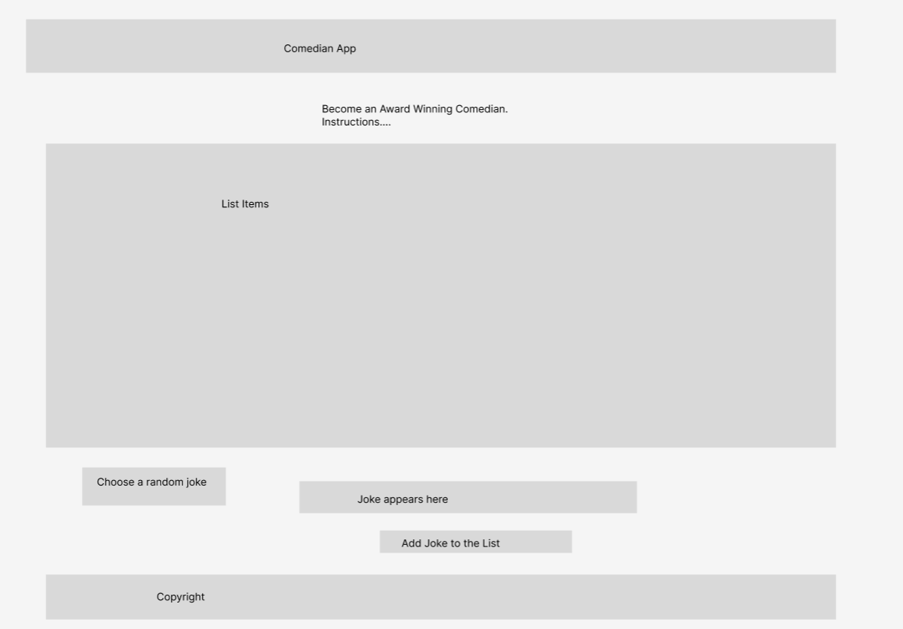
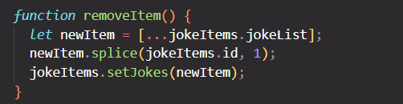
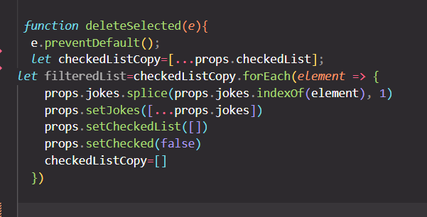

# Comedy Pro

## Inspiration

This site was created as a General Assembly individual project on React. It was inspired by me having done standup comedy for a number of years. It's a way of coming up with a comedy routine
without any time or effort by using the "Dad Joke" generator. 
In keeping with the spirit of dad jokes, the "About" Section describes the joke generator as the best thing since sliced bread. Use cases include: 
-Impressing a first date / your inlaws
-Wowing the audience with a wedding speech
-Transforming oneself from a wallflower the life and soul of a party
In case the site takes off(it won't) disclaimers will be added such as me not taking liability for physical injuries inflicted by audience members throwing fruit at the comedian or interpersonal issues caused by exasperated friends and family. 

### Timelines

As I had to go to Switzerland for five days where I was busy with a house move during the project week, timelines were tight. 
The key focus was therefore on the MVP and a basic styling as opposed to implementing suggested additional features. The core requirements were met. 

### Technologies Used

The site utilised React with CSS. The React Router was installed via NPM to create different page views. https://icanhazdadjoke.com was the API utilised for the site. It was edited via Visual Studio Code and version control was carried out via GitHub.
 
### Core Requirements
The below requirements were provided by General Assembly which were met by the site. 

	

### Layout

The layout was designed with the spirit of dad jokes in mind. A picture of Tommy Cooper was added to represent 
an older comedian using cheesy jokes(I don't know his comedy well but his image suggests that could be his comedy style). The design is evocative of the 70's when Tommy Cooper was a regular performer. 

The colour scheme was taken from a palette of pink, purple and yellow shades found on the internet as recommended colors that would complement each other.

### Planning

The first stage of planning involved creating a wireframe using Figma. 

Pseudocode was then produced. As the project evolved the functionality ended up deviated from this pseudocode. 

[PseudoCode](src/ComedianPseudoCode.txt)

## Coding Process

Components were split between files to make the code neater. 

The React Router was imported and used to create different page views. This was combined with a Navigation Component placed at the top of the page to enable the user to easily navigate to different pages. 

In the List Component, the array of jokes was mapped to split each joke into a separate List Item. The full List Item content was then created in the List Item Component. 

The remove item function was a simple matter of copying the jokes list, splicing the value from the list and setting the jokes list to the list with the item removed. 

Selecting a deleted item was more complex. To delete selected items a list of IDs was compiled. Whenever a checkbox was checked an id was be added to the list.  If the user clicked the button to "delete selected" the jokelist was set to be updated, splicing the items that weren't checked. The list of checked items was then set to be an empty array. The list was provided to the Form Component via the React useState Hook. This hook was employed whenever data needed to be provided to child components from their parents. 

The API data was retrieved using a fetch command. React's useEffect Hook  was employed to prevent the API from running too many times.

Throughout the project frequent commits were made for a strong version control.

### Challenges

The project was not as advanced as I would have wanted due to timeframes, even with an extension I only had three full days to work on this, even with an extension. This is why the technical focus was on the core requirements and basic layout only. 

Technically, a key challenge was deleting selected items. Originally the setState hook parameters were set up in the child which caused a number of issues. 
A key learning was that the setState should be defined at a parent level and that a setState is the only way to provide information from a parent to a child. After this was known the delete selected items functionality could be implemented. 

The deployment was also challenging. Instructions for deploying React with Github were followed but the issue remained. An issue with running React on the localhost has been ongoing which made progress. Although a workaround was used this slowed down progress with React. 

### Wins / Learnings / Open Points

On a personal note I found that my understanding of React was much improved while doing the project. Due to the issue with deleting selected items I was able to take some more critical learnings away. 

Some issues were found when trying to create a "Favourites Page"(since abandoned) which uncovered further gaps in my knowledge, mainly: how can parameters be passed between different pages which I intend to learn asap. 

I have found out about Redux which looks extremely useful which I will investigate further when I have the time. 

An issue with using indices to delete items also raised the need to investigate how custom IDs can be created for items. 

### Bugs

A bug was found after checked items were removed. It was observed that items were automatically ticked after this removal. It is believed that this issue is due to using the joke items' index as an id as opposed to using a unique ID. Another potential solution may be to remove any default checkbox checking. Due to time constraints the root cause could not be fully determined. 

As mentioned above there was also an issue with the deployment.

### Future Improvements

In the future I would like to create a page to display favourite jokes only. This would involve passing parameters to different pages which is something I would like to get experience in. 

I would also play around with the layout to make it neater and more user-friendly. To utilise the app(in case anyone might ever have the need for bad dad jokes) the site should be made responsive. 

It could also be fun for all the jokes to be read by the user's machine with canned laughter after each joke. 

